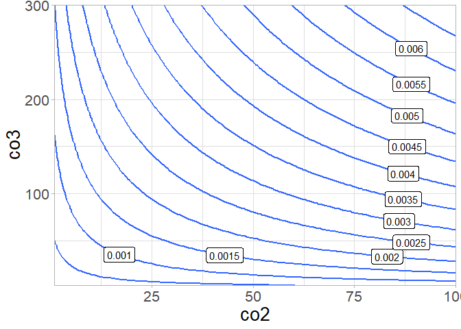

README
================
David Kaiser
29 8 2020

## Carbonate System - relationships between parameters

Find an interactive `shiny` app that displays the relationship between
different parameters of the carbonate system
[**here**](https://davidatlarge.shinyapps.io/shiny_carb_plot/?_ga=2.134770553.964002575.1598730102-1166230829.1598207332).
The concentrations of CO2 and CO32- on
the axes are in µmol kg-1. The other parameters are
calculated using `seacarb::carb()`. The values on the contours are in
mol kg-1\! The plot is inspired by an old [presentation by
Andrew Dickson](https://www.youtube.com/watch?v=dR917nXLEHU).

<!-- -->

    ##   co2 co3  pH      fCO2      pCO2   fCO2pot   pCO2pot fCO2insitu pCO2insitu
    ## 1   0   0 NaN   0.00000   0.00000   0.00000   0.00000    0.00000    0.00000
    ## 2   1   0  NA  35.22134  35.33404  35.22134  35.33404   35.22134   35.33404
    ## 3   2   0  NA  70.44267  70.66809  70.44267  70.66809   70.44267   70.66809
    ## 4   3   0  NA 105.66401 106.00215 105.66401 106.00215  105.66401  106.00215
    ## 5   4   0  NA 140.88534 141.33622 140.88534 141.33622  140.88534  141.33622
    ## 6   5   0  NA 176.10668 176.67029 176.10668 176.67029  176.10668  176.67029
    ##   HCO3   DIC ALK OmegaAragonite OmegaCalcite
    ## 1  NaN   NaN NaN              0            0
    ## 2    0 1e-06 NaN              0            0
    ## 3    0 2e-06 NaN              0            0
    ## 4    0 3e-06 NaN              0            0
    ## 5    0 4e-06 NaN              0            0
    ## 6    0 5e-06 NaN              0            0
